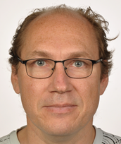

<html>

<!-- Navigation -->

<nav style="margin-bottom: 20px; border-bottom: 1px solid #e0e0e0; padding-bottom: 10px;">
  <a href="/lab/" style="text-decoration: none; margin-right: 20px; color: #333;">Home</a>
  <a href="/lab/team/" style="text-decoration: none; margin-right: 20px; color:#333;">Team</a>
  <a href="/lab/projects/" style="text-decoration: none; margin-right: 20px; color: #333;">Projects</a>
  <a href="/lab/news/" style="text-decoration: none; color: #333;">News</a>
</nav>

<body>

<main>	
<article>

<body class="lab-list">

<!-- Current PI(s) -->

<h3 style="margin: 0;">Dr. Asya Achimova</h3>
<h4 style="margin: 0;">(Group Leader)</h4>

 
 

I’m interested in the ways speakers combine information from multiple sources to arrive at a coherent interpretation of utterances they read and hear. In particular, I investigate how their background beliefs about the structure of events affects language comprehension. I additionally ask how speakers factor in listener’s background beliefs in deciding how to describe events. Finally, I look at how communicative goals that go beyond pure information transfer shape human communication and inferences we draw about each other.

 

<!-- Links --->

 
 

 

        
    
<!-- Current non-PIs -->
         

                       

 
 

<h3 style="margin: 0;">Ivan Rygaev</h3>
<h4 style="margin: 0;">(PhD Student)</h4>

 
 

My research lies at the intersection of experimental and computational pragmatics. I investigate how prior expectations about the predictability of events shape the production and comprehension of referring expressions, as well as presupposition projection. Beyond reference, my research interests include philosophy of language and mind, formal dynamic semantics (especially DRT), mental states and propositional attitudes. I also have a strong background in software development, automated logical reasoning, the Semantic Web, knowledge graphs, and natural language processing.

 
<!-- Links --->

 
 

 
         

<h3 style="margin: 0;">Laura Friedrich</h3>
<h4 style="margin: 0;">(PhD Student)</h4>

 
 

I am a PhD student in Project C4 of the Collaborative Research Centre (CRC) 1718 at the University of Tübingen, where I investigate the development of irony comprehension in children. I conduct experimental research with young German-speaking children to explore how theory of mind, common ground, and cognitive abilities contribute to their understanding of irony. Building on my background in multilingualism, I am broadly interested in language acquisition, particularly bilingual development and its role in shaping pragmatic skills.

 
 

 

            
                

<h3 style="margin: 0;">Gemma Seghi</h3>
<h4 style="margin: 0;">(PhD Student)</h4>

 
 

I am a PhD student in Project C4 of the Collaborative Research Centre (CRC) 1718 at the University of Tübingen. My research focuses on how language is used in social interaction and on the cognitive mechanisms, such as theory of mind and common ground tracking, that support pragmatic language use and its development. I aim to bridge human experimental research, Bayesian cognitive models, and large language models to better understand how these abilities emerge and operate in both humans and artificial systems. I am currently focusing on modeling the development of irony comprehension as a testbed for investigating these processes.

 
 

 

           

<h3 style="margin: 0;">Natalia Krasikova</h3>
<h4 style="margin: 0;">(PhD Student)</h4>

 
 

My research interests lie in formal and experimental semantics and pragmatics, with a focus on how meaning is derived through pragmatic inference. I am particularly interested in presuppositions, implicatures, and the role of alternatives in shaping interpretation. In my work, I combine formal approaches with experimental methods to investigate how listeners arrive at enriched meanings and how factors such as background beliefs, context, and available alternatives influence this process. My earlier work on modality focused on how the strength of modal meanings arises from the interaction of contextually determined scales and pragmatic factors. More recently, I have also become interested in how such interpretive processes can be captured using computational modelling.

 
 

 

         

<h3 style="margin: 0;">Elvan Doğan</h3>
<h4 style="margin: 0;">(Lab Manager)</h4>

 
 

Elvan is lab manager and research assistant at the lab. She studies English Linguistics, with research interests in various disciplines in the linguistic field. 

 
 

 

<h3 style="margin: 0;">Yingjie Xiao</h3>
<h4 style="margin: 0;">(Research Assistant)</h4>

 
 

Yingjie is a research assistant at the lab, where he works on experimental design, data processing, and data analysis for ongoing research involving linguistic and behavioral data. He studies Computational Linguistics, with research interests in causality, semantic transparency, and morphological productivity in language.

 
 

 
   

<h3 style="margin: 0;">David Siecke</h3>
<h4 style="margin: 0;">(B. Sc. Student)</h4>

 
 

David is writing his Bachelor's thesis in the lab. His work focuses on presupposition accommodation, how it is affected by different types of presupposition triggers and entailment-canceling environments, and whether there is individual variability in the preference for accepting either presupposed or asserted information. He studies Cognitive Science at Osnabrück University, with research interests in psycholinguistics and cognitive psychology.

 
 

 

<h3 style="margin: 0;">Antonia Roswitha Sophie Höfer</h3>
<h4 style="margin: 0;">(M. Sc. Student)</h4>

 
 

I am a master student in cognitive science with research interests in linguistics, reasoning as well as cognitive systems. I am currently investigating within my master thesis how beliefs about plausibility influence the perception of speech under noise.

 
 

 

<h3 style="margin: 0;">Jasmin Valerie O'Brien</h3>
<h4 style="margin: 0;">(B. Sc. Student)</h4>

 
 

I am a bachelor’s student working on my thesis with Asya Achimova at the University of Tübingen, where I investigate how people respond to controversial topics when confronted with another person’s opinion. I conduct experimental research with German- and English-speaking participants to explore whether individuals respond directly, indirectly, or oppositionally to topics that vary in perceived controversy. I am interested in social communication, interpersonal interaction, and the ways linguistic and cultural factors shape pragmatic behavior across different contexts.

 
 

 

         
</body>

</article>

</main>
</body>

</html>

